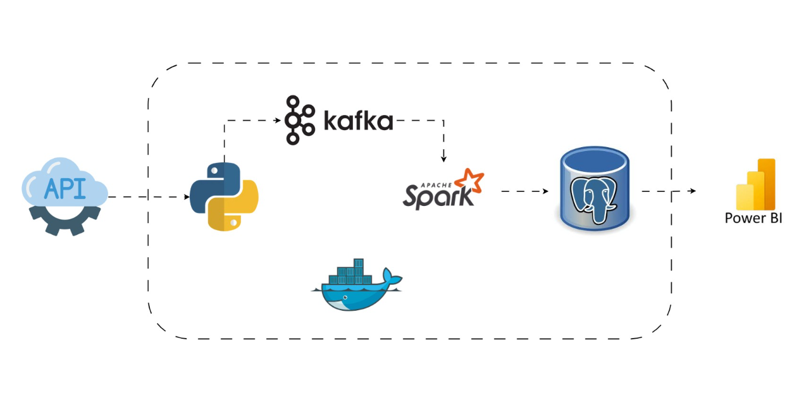

# Real-Time Stock Market Insights & Reporting

## Overview
MarketPulse Analytics is a New York–based FinTech company providing real-time market insights to institutional investors. As data volume and trading activity increase, the company requires a fast, reliable, and scalable data platform.

This project implements a real-time data pipeline that ingests live market data, processes it as it arrives, stores it efficiently, and delivers insights through dashboards.

## At a Glance
- **Type**: Real-time streaming data pipeline  
- **Domain**: Financial markets / FinTech  
- **Latency Focus**: Low-latency, event-driven  
- **Consumers**: Institutional investors & analysts  
- **Deployment**: Containerized (Docker)  

## Business Context
> Speed matters in financial markets. Delays in data processing lead to missed opportunities, especially during peak trading periods.

> This system removes latency and scalability bottlenecks to support real-time decision-making.

## Key Challenges
- Data latency during peak hours  
- Limited monitoring and fault detection  
- Scalability constraints  

## Project Goals
- Process market data in real time  
- Minimize end-to-end latency  
- Store data for reporting and analysis  
- Deliver live dashboards  

## Architecture Overview

## Design Considerations
- Streaming-first architecture to avoid batch delays  
- Decoupled ingestion and processing for fault tolerance  
- Built to handle traffic spikes during peak market hours  

## Technology Stack
- Python  
- Apache Kafka  
- Apache Spark  
- PostgreSQL  
- Docker & Docker Compose  
- Power BI  

## Simple Data Flow
**External APIs → Python → Kafka → Spark → PostgreSQL → Power BI**

## How the System Works
- Market data is ingested from external APIs using Python  
- Events are streamed through Kafka for reliability and scale  
- Spark processes and enriches data in real time  
- Processed data is stored in PostgreSQL  
- Power BI reads from PostgreSQL to power live dashboards  

## Outcomes
- Low-latency real-time analytics  
- Reliable performance at scale  
- Faster decision-making for clients  

## Project Status
Production-style implementation designed for scalability and future extension.
